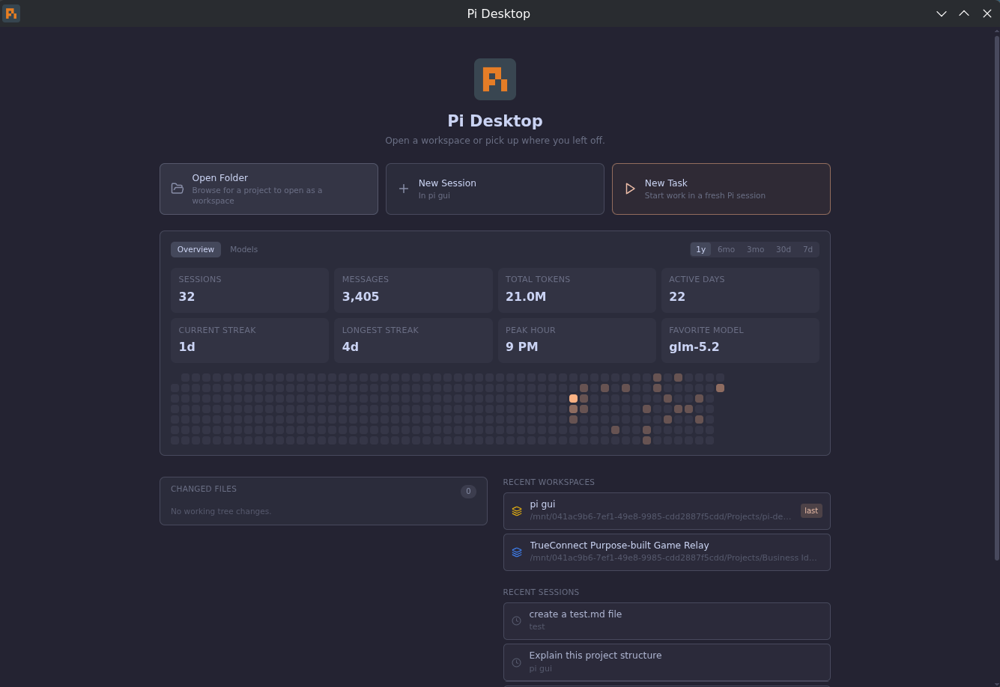

# Sessrúmnir

A desktop GUI for the [Pi](https://pi.dev) and [oh-my-pi](https://github.com/can1357/oh-my-pi) coding agents. Chat, manage projects, browse files, run commands, and install packages in one window.

> **Ymir adoption:** this is a vendored fork of the Apache-2.0 **pi-desktop**
> project (`github.com/FaqFirebase/pi-desktop`, v0.1.7-alpha), rebranded
> **Sessrúmnir** and wearing the carved cloth of the halls (stone, bone, bronze
> and blood — the landing page's own palette and type). See `AGENTS.md` for the
> adoption notes; upstream provenance and license are preserved.



Still in alpha, so expect rough edges.

## What it does

- Streaming chat with thinking blocks, tool use, and rich rendering: bundled fonts and color emoji, inline SVG preview, and clickable file links that open a preview pane. Consecutive tool calls fold into collapsible groups. File reads show as line-numbered, syntax-highlighted code and edits as diffs
- Find within a conversation (`Ctrl/Cmd+F`); streaming follows new output only while you're at the bottom, with a jump-to-bottom control
- Composer file mentions (type `@` to insert a path reference for Pi to read) and `Up`/`Down` to recall prompts sent in the current session
- Home dashboard with usage stats: messages, tokens, active-day streaks, peak hour, and a per-model breakdown
- [Multi-Agent Council Planning](#multi-agent-council-planning), where Pi, Claude, and Codex plan together and reach consensus before Pi builds (opt-in)
- Quick switcher (`Ctrl/Cmd+K`) for skills, prompt templates, built-in commands, workspaces, sessions, and files; `/` in the composer for commands
- Skills browser, session fork/branch tree, and one-click context compaction
- Session naming (read from Pi) with inline rename, and a themed in-app confirmation for delete
- Custom models & providers editor in Settings, which edits your engine's models file (`~/.pi/agent/models.json` for Pi, `~/.omp/agent/models.yml` for OMP)
- Multiple workspaces, with an independent agent process per live session, so a turn keeps running when you switch away from it; Mission Control and sidebar activity dots surface background work across projects, with optional desktop notifications when a session finishes, fails, or waits for approval
- New Task launcher starts a real fresh Pi session in a selected project, optionally in an isolated Git worktree, and sends the issue immediately while work continues in the background; matching task metadata, explicit branches, and GitHub PR URLs reuse an existing local worktree when found
- Diff Review conveyor with explicit Commit → Push → PR actions, upstream-aware GitHub CLI PR creation, and exact notification clicks back to the finished session
- Diagnostics view: Pi/OMP install and PATH resolution, provider configuration, permissions, and recent errors
- Review rail (toggleable) with permissions, approvals, changed files, and session status
- Custom permission rules: allow/deny glob rules per Pi tool that refine the permission modes, with per-workspace rule files, import/export, and live edits that apply without restarting Pi
- File tree, code/image/PDF/HTML preview panes, code editor (CodeMirror 6 with syntax highlighting), diff viewer, file search
- Terminal with ANSI colors
- Package browser connected to pi.dev/packages, with instant local search and update checks for installed packages
- Session tags, model switching, live-preview settings, themes (8 built-ins — Sessrúmnir is the default — plus System, and custom themes you can create in-app, import, export, or install from a URL)
- [Translatable interface](#languages): pick the language in Settings (English ships today)

## Review rail

The right-side Review rail keeps safety and working-tree state visible while you chat with Pi. Toggle it from the chat toolbar (hidden by default, so it doesn't compete for space with file/image previews).

Changed files use readable status badges:

| Badge | Meaning |
|-------|---------|
| `NEW` | Untracked new file |
| `MOD` | Existing tracked file was modified |
| `DEL` | Tracked file was deleted |
| `ADD` | New file staged in git |
| `STG` | Modified file staged in git |
| `REN` | File was renamed |

## Pi and OMP engines

Sessrúmnir speaks Pi's RPC protocol directly, so it can run either the standard `pi` CLI or the compatible `omp` binary from [oh-my-pi](https://github.com/can1357/oh-my-pi). **Settings → Agent Configuration → Agent Installation** scans for installed engines, lets you select one, and also supports a custom executable or install directory.

Each engine keeps its own sessions: Pi writes to `~/.pi/agent/sessions`, OMP to `~/.omp/agent/sessions`. The app reads both, so switching engines never hides your history. When sessions from both appear in one list, each row is tagged `Pi` or `OMP`, and opening one starts the engine that wrote it.

OMP's protocol-v2 large-frame transport is negotiated automatically, and model-specific thinking efforts, including `max`, are shown when advertised. Its native `read`, `grep`, and `glob` tools are used for Plan / Read-only mode, and its plugin install/update/remove verbs are mapped behind the existing package actions.

## Permissions

Four base modes control what Pi may do, selectable from the Review rail or **Settings → Behavior**:

| Mode | Behavior |
|------|----------|
| Plan / Read-only | Only read/search/list tools are enabled; edits and shell commands are blocked |
| Ask before edits | Pi asks before file edits and shell commands |
| Ask before commands | Pi asks before shell commands |
| Trusted | All tools enabled |

Custom permission rules refine the modes with allow/deny rules per Pi tool, edited in **Settings → Behavior → Permission rules**:

- A rule is an action (`allow`/`deny`), a tool name (`bash`, `edit`, `write`, `read`, … or `*` for any), and an optional glob pattern matched against the tool's input: the shell command for `bash`, the file path for file tools. `*` is the only wildcard.
- Precedence: deny beats allow, and allow beats the mode default. Deny rules are enforced in every mode; a `deny * *.env*` rule holds even in Trusted. Allow rules skip the confirmation prompt in the ask modes.
- Rule edits apply to the next tool call without restarting Pi.
- Rules come in two scopes. The **Global | This workspace** tabs edit either your global rules or the active workspace's `.pi-desktop/permission-rules.json`. A workspace file is gated by workspace trust: once you trust the workspace it fully replaces the global list while you work there. Until then (the default for a repo you just opened) only its *deny* rules apply, layered on top of your global rules, and its *allow* rules are ignored, so a cloned repo can tighten your permissions but never loosen them. Opening a workspace whose file contains allow rules prompts you to trust it; you can also Trust/Revoke from the **This workspace** tab. Import/Export moves rule lists as JSON files, and the workspace file can be hand-edited or committed with a repo. The app picks up changes live.
- One honest caveat: rules match raw strings, with no path canonicalization or command parsing. Treat them as a guardrail against accidents rather than a security sandbox, and keep even a trusted workspace's allow rules narrow.

Example rules:

```json
{ "action": "allow", "tool": "bash", "match": "npm test*" }
{ "action": "deny",  "tool": "bash", "match": "rm -rf *" }
{ "action": "deny",  "tool": "*",    "match": "*.env*" }
```

## Custom themes

Sessrúmnir ships 7 built-in themes (Dark, Light, Nord, Gruvbox, Breeze Dark, Breeze Light, Breeze Claudius) plus System, and you can create your own from **Settings → Appearance**. With **System** selected, **Light Theme** and **Dark Theme** choose which installed theme each OS mode uses.

To build one in the app, click **Create theme** to fork the currently active theme, or **Edit theme** to keep editing one you already created. Pick 7 seed colors (app background, surface, text, accent, success, warning, error) and a dark or light kind; every other color in the app is derived from those seeds. Changes preview live across the whole window as you edit. Two disclosures cover finer control:

- **Advanced** lets you override any of the ~30 derived tokens individually (borders, hovers, scrollbars, and so on) instead of accepting the automatic derivation.
- **Syntax colors** overrides the code-highlighting colors (keywords, strings, comments, etc.) used by the code editor and diff viewer.

Themes you create are listed alongside the built-ins in the **Theme** dropdown. Rename one by editing its name in the editor, duplicate one by selecting it and clicking **Create theme** (which forks whatever is active), and delete one with the **Delete** button that appears next to the dropdown whenever a custom theme is selected.

To share a theme, use **Import** and **Export** to move it as a `.json` file, or paste an `https://` URL into **Install from URL** to fetch and install one directly (HTTP is rejected, and downloads are size-capped).

A theme file uses the `pi-theme/v1` format: JSON with a `$schema`, a `name`, a `kind` (`"dark"` or `"light"`), and 7 `seeds`. That's enough for a complete, valid theme; everything else is derived automatically via CSS `color-mix()`:

```json
{
  "$schema": "pi-theme/v1",
  "name": "My Theme",
  "kind": "dark",
  "seeds": {
    "app": "#0a0a0a",
    "surface": "#171717",
    "text": "#f5f5f5",
    "accent": "#2563eb",
    "success": "#34d399",
    "warning": "#facc15",
    "error": "#f87171"
  }
}
```

Two optional top-level objects let you pin exact values instead of relying on derivation: `overrides` (any derived token, e.g. `border`, `scrollbar`, `accent-hover`) and `syntax` (code-highlighting colors, e.g. `keyword`, `string`, `comment`). Omit both and the theme still renders correctly from the 7 seeds alone.

User theme files live in the app's user-data directory under `themes/` (on Linux, `~/.config/pi-desktop/themes/`).

There's also a community gallery at [themes](apps/sessrumnir/themes): copy any theme's raw URL into **Install from URL**, or submit your own with a pull request.

## Languages

Pick the interface language in **Settings → Appearance → Language**. **System default** follows your operating system's language list and falls back to English. The change applies when you click **Save Settings**, with no restart.

English is the only bundled language today. Each language is one JSON file in `resources/locales/<code>/translation.json`; see [Translations](CONTRIBUTING.md#translations) to add one.

Only the app's own text is translated. Chat replies, file contents, and names of models, packages, and sessions stay as they are. Logs and the copied Diagnostics report stay in English, so bug reports stay readable.

## Multi-Agent Council Planning

Pi, Claude, and Codex each produce an initial plan, share and converge, and Pi presents the agreed consensus plan *before* anything is built. All members plan read-only; Pi is the only agent that edits files.

The feature is off by default. Enable it in **Settings → "Multi-Agent Council Planning"**; a confirmation dialog warns that it increases token and credit usage, since each request runs multiple agents.

The app auto-detects each member's CLI cross-platform, and only detected agents can be enabled (per-agent checkboxes). At least two members must be available or a run is refused. Pi always merges the plans into the final consensus, even when it isn't checked as a planner.

Every member plans read-only: Claude runs with `--permission-mode plan`, Codex with `--sandbox read-only`, and Pi with write tools excluded. They produce plans but never modify files. Only Pi implements the approved result.

During the consulting phase, each member streams its plan live in its own card with an elapsed timer.

There are two consensus modes:

- **One debate round** (default): each member sees the others' plans and revises once, then Pi merges. You watch them converge.
- **Arbiter merge**: faster and cheaper. Pi synthesizes the initial plans directly with no debate round.

A per-member timeout (10 to 600 seconds, default 240) bounds each member. A member that times out or errors is dropped, and the run proceeds as long as at least one plan was produced.

To use it, type your request with the feature enabled and click **Plan with Council** in the composer. Review each member's plan and Pi's merged consensus plan. If you want changes, type feedback in **Request changes to the plan…** and Pi revises the consensus; repeat as needed. When you're happy, click **Implement this** and Pi builds it. The panel collapses once a plan is ready so the output stays readable.

## Getting started

You need Pi installed first:

```bash
npm install -g @earendil-works/pi-coding-agent
```

On Linux, grab the AppImage from [Releases](https://github.com/zerwiz/ymir/releases):

```bash
chmod +x Pi-Desktop-*.AppImage
./Pi-Desktop-*.AppImage
```

### macOS

Download the `.dmg` (Apple Silicon / arm64) from [Releases](https://github.com/zerwiz/ymir/releases), open it, and drag **Sessrúmnir** to Applications.

Builds are **not yet signed or notarized**. Because the download is unsigned, macOS quarantines it, and on first launch Gatekeeper shows this dialog (this is macOS's message, not our advice):

> Sessrúmnir is damaged and can't be opened. You should move it to the Trash.

**Do not move it to the Trash.** The app is not damaged; this is just how Gatekeeper phrases its block on any unsigned app. macOS offers no "Open Anyway" button for this particular dialog, so clear the quarantine flag in Terminal instead:

```bash
xattr -dr com.apple.quarantine "/Applications/Sessrúmnir.app"
```

Then open the app normally. You only need to do this once.

> If macOS instead says the app **"cannot be opened because Apple cannot check it for malicious software,"** you can allow it without Terminal: open **System Settings → Privacy & Security**, scroll to the **Security** section, and click **Open Anyway** next to the Sessrúmnir notice, then confirm with Touch ID / your password.

> If you'd rather skip the unsigned-app warnings entirely, build from source. A build you compile yourself runs locally without Gatekeeper blocking it, so there is no signing prompt and no quarantine flag to clear. See [Build it yourself → Linux / macOS](#linux--macos) below.

### Windows

Download from [Releases](https://github.com/zerwiz/ymir/releases): the **installer** (`…-win-x64-setup.exe`, recommended) or the **portable** `…-win-x64.exe`. Builds are unsigned, so SmartScreen may warn; choose **More info → Run anyway**. If file edits or saves fail, see the [Controlled Folder Access](#controlled-folder-access-ransomware-protection) note below. Windows is community-tested; please [open a bug report](https://github.com/zerwiz/ymir/issues) if you hit an issue.

## Keyboard shortcuts

| Shortcut | What it does |
|----------|-------------|
| `Enter` | Send message |
| `Shift+Enter` | New line |
| `Up/Down` | Recall previous prompts |
| `@` | Mention a workspace file |
| `Escape` | Stop streaming |
| `Ctrl/Cmd+K` | Open command palette |
| `/` (start of message) | Open command palette |
| `Ctrl+P` (composer focused) | Cycle model |
| `Ctrl/Cmd+F` | Find in conversation |
| `Ctrl/Cmd+Shift+F` | File search |
| `Ctrl+Shift+P` | Insert saved note |
| `Ctrl/Cmd+N` | New session |
| `Ctrl/Cmd+Shift+N` | New workspace |
| `Ctrl/Cmd+O` | Open project |

## Build it yourself

### Linux / macOS

```bash
git clone https://github.com/zerwiz/ymir.git
git sparse-checkout init --cone --sparse-index
git sparse-checkout set apps/sessrumnir
cd apps/sessrumnir
npm install
npm run dev
```

### Windows

Windows requires extra steps because **node-pty** (the terminal backend) compiles a native module against Electron's ABI.

#### 1. Install prerequisites

Install all of the following **before** cloning:

- [Git for Windows](https://git-scm.com/download/win)
- [Node.js LTS](https://nodejs.org), via the official Windows installer (adds `node` and `npm` to PATH)
- **Visual Studio Build Tools 2022**, downloaded from [Visual Studio downloads](https://visualstudio.microsoft.com/downloads/#build-tools-for-visual-studio-2022)
  - Select the **Desktop development with C++** workload
  - Open **Individual components**, search `Spectre`, and install **Spectre-mitigated libs for v143 toolset**

> **Use VS Build Tools 2022, not 2026.** node-pty requires Spectre-mitigated runtime libraries. VS 2022 stable (v143 toolset) ships them; VS 2026 preview (v180 toolset) does not, and `npm install` will fail with `MSB8040: Spectre-mitigated libraries are required for this project`.

#### 2. Add a Windows Defender exclusion (recommended)

Defender can block or slow `npm install` on projects with many small files. Before cloning, add an exclusion:

Settings → Privacy & Security → Windows Security → Virus & threat protection → Manage settings → Exclusions → Add a folder → (pick where you'll clone the repo)

#### 3. Clone and install

```powershell
git clone https://github.com/zerwiz/ymir.git
git sparse-checkout init --cone --sparse-index
git sparse-checkout set apps/sessrumnir
cd apps/sessrumnir
npm install
```

The postinstall script rebuilds `node-pty` against Electron's ABI and downloads the Electron binary. First install may take a few minutes.

If the Electron binary is missing after install, use the [manual Electron binary download](#manual-electron-binary-download) steps below. This is the confirmed fallback on Windows when Electron's postinstall extraction leaves a partial `dist` folder.

#### 4. Install Pi

```powershell
powershell -c "irm https://pi.dev/install.ps1 | iex"
```

Open a **new terminal** after this so the updated PATH takes effect.

#### 5. Run

```powershell
npm run dev
```

#### Common Windows errors

| Error | Cause | Fix |
|-------|-------|-----|
| `MSB8040`: Spectre libs missing | VS Build Tools 2026 (v180 toolset) installed instead of 2022 (v143) | Uninstall 2026, install VS Build Tools 2022 with Spectre libs for v143 |
| `electron-vite is not recognized` | `npm install` didn't complete | Run `npm install` again |
| Electron binary missing after install | Electron's postinstall extraction left a partial or missing `dist` folder | Add the repo folder to Defender exclusions, then `npm install` again. If it still fails, use the manual download steps below |
| `EPERM` / `EACCES` writing a project file | Controlled Folder Access (Ransomware protection) is blocking writes under Documents/Desktop | Keep the repo and your projects out of protected folders, or allow Sessrúmnir through Controlled folder access (see below) |
| Pi shows "error" in status popover | Pi not installed or PATH not updated | Run the install script above in a **new** terminal window |

#### Controlled Folder Access (Ransomware protection)

Windows **Controlled Folder Access** protects `Documents`, `Desktop`, `Pictures`, and similar folders by silently blocking apps it doesn't trust from writing to them. Because Sessrúmnir is a coding agent that edits files, this shows up as intermittent `EPERM`/`EACCES` failures (during `npm install`, when the agent edits code, or when you save a file) if your repo or projects live inside a protected folder.

The reliable fix is to keep code out of protected folders. Clone the repo and put your projects somewhere unprotected, for example:

```powershell
# Not C:\Users\<you>\Documents\... — use an unprotected path:
git clone https://github.com/zerwiz/ymir.git
cd apps/sessrumnir
```

If you must keep code under Documents/Desktop, allow the app instead:

**Windows Security → Virus & threat protection → Ransomware protection → Manage ransomware protection → Allow an app through Controlled folder access → Add an allowed app**, then add the installed `Sessrúmnir.exe` (and, for development, `node.exe`, `git.exe`, and `electron.exe`).

> The portable `.exe` re-extracts to a temporary folder on each launch, so allow-listing it doesn't stick. Prefer the **installer** (`Pi-Desktop-<version>-win-x64-setup.exe`) if you rely on the allow-list approach.

#### Manual Electron binary download

If `npm install` completes but the app won't launch because Electron is missing or corrupted, download it directly from GitHub and unpack it into place. This is the known-good fallback when `node_modules\electron\dist` contains only partial contents, such as `locales`, and no `electron.exe`.

Replace `43.0.0` with the version in `node_modules/electron/package.json` if it differs.

```powershell
$ver = "43.0.0"
$url = "https://github.com/electron/electron/releases/download/v$ver/electron-v$ver-win32-x64.zip"
$zip = "$env:TEMP\electron-v$ver-win32-x64.zip"
Invoke-WebRequest -Uri $url -OutFile $zip
if (Test-Path node_modules\electron\dist) { Remove-Item -Recurse -Force node_modules\electron\dist }
Expand-Archive -Path $zip -DestinationPath node_modules\electron\dist -Force
"electron.exe" | Out-File -Encoding ASCII -NoNewline node_modules\electron\path.txt
"v$ver" | Out-File -Encoding ASCII -NoNewline node_modules\electron\dist\version
```

After this, `npm run dev` should work normally.

> **Note:** Windows builds are community-tested. If you hit an issue not listed above, please [open a bug report](https://github.com/zerwiz/ymir/issues).

## License

Apache 2.0

## Links

- [pi-desktop.com](https://pi-desktop.com)
- [pi.dev](https://pi.dev)
- [Packages](https://pi.dev/packages)
- [Issues](https://github.com/zerwiz/ymir/issues)
