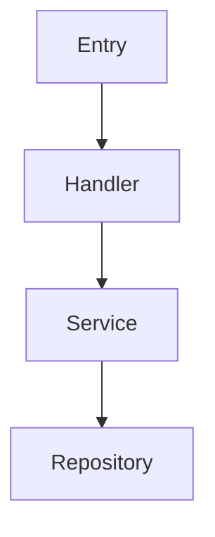

# Phase 1: Add Layer 3 (Program Design) to create-plan Skill

**Project**: command (COM)
**Priority**: Critical
**Estimated Effort**: 5 days
**Status**: ✅ COMPLETED (2026-09-10)
**Measurable Goal**: `plan_layer3_compliance:100%:mcp_validation:30d:90%`

---

## Problem Statement

The current `create-plan` skill template does not enforce **Layer 3 (Program Design)** from Dex Horthy's four-layer framework. This is "the layer everyone skips" — where the agent makes silent structural decisions (file locations, type signatures, call stack, test shapes) that you later dislike. Per the research: "A good plan ends with the tests and the call stack. The point is that these are decisions the agent will otherwise make silently, and that you may not like."

## Current State

- `create-plan` skill at `~/.config/opencode/skills/create-plan/SKILL.md` has template with Overview, Current State, Desired End State, Implementation Approach, Phases, Testing Strategy
- **Missing**: File Map, Type Signatures, Call Stack Visualization, Test Shapes (signatures only)
- `validate-plan` skill checks completeness, paths, rules, feasibility, risks — but **does not validate Layer 3 exists**

## What Was Implemented

### 1. Updated `create-plan` Skill Template
**Location**: `~/.config/opencode/skills/create-plan/SKILL.md` (opencode config)

Added mandatory **Program Design (Layer 3)** section to the plan template:

```markdown
## Program Design (Layer 3 — MANDATORY)

### File Map
| Component | Path | Responsibility |
|-----------|------|----------------|
|           |      |                |

### Type Signatures
```typescript
// Exact interfaces before implementation
interface X { }
type Y = ;
```

### Call Stack Visualization


### Test Shapes (Signatures Only)
```typescript
describe('Feature', () => {
  it('should do X', () => { /* shape */ })
  it('should handle Y', () => { /* shape */ })
})
```

### 2. Updated `validate-plan` Skill
**Location**: `~/.config/opencode/skills/validate-plan/SKILL.md`

Added validation checks for Layer 3 (section 1e):
- Program Design section exists
- File Map has at least 1 entry
- Type Signatures section has code block
- Call Stack Visualization has mermaid diagram
- Test Shapes section has at least 2 test signatures

Verdict: ❌ REJECTED if Layer 3 missing or incomplete.

### 3. Updated Global Plan Template
**Location**: `$HOME/CodeP/wayofmono/thoughts/global/templates/plan-template.md` (rewritten)

Complete rewrite including:
- Linked Ticket section
- Measurable Goal (from Ticket) section
- Program Design (Layer 3 — MANDATORY) section
- Phase 0: Vertical Slice Definition section

### 4. Integration with `ticket-executor`
**Location**: `~/.config/opencode/skills/ticket-executor/SKILL.md`

Phase 0 Validation Gate now also requires Layer 3 present; refuses to start if missing.

## Implementation Approach

Edited skills directly in opencode config (`~/.config/opencode/skills/`), then copied new skills to `command` project for MCP registration.

1. Edited `create-plan/SKILL.md`: Inserted Layer 3 section after Architecture, before Pre-Mortem; reordered so pre-mortem follows Layer 3
2. Edited `validate-plan/SKILL.md`: Added section 1e Layer 3 validation (REJECTED if missing/incomplete) + output format
3. Rewrote global `plan-template.md` at `CodeP/wayofmono/thoughts/global/templates/plan-template.md`: Full template with Linked Ticket, Measurable Goal, Layer 3, Phase 0
4. Edited `ticket-executor/SKILL.md`: Phase 0 gate now requires Layer 3 present

## Phases

- [x] Phase 1.1: Update create-plan skill template (1 day)
- [x] Phase 1.2: Update validate-plan skill validation (1 day)
- [x] Phase 1.3: Update global plan template (0.5 day)
- [x] Phase 1.4: Update ticket-executor Phase 0 gate (0.5 day)
- [x] Phase 1.5: Documentation (0.5 day)

## Success Criteria

### Automated Verification:
- [x] `create-plan` produces plans with Layer 3 section
- [x] `validate-plan` rejects plans without Layer 3 (section 1e)
- [x] `validate-plan` approves plans with complete Layer 3
- [x] `ticket-executor` Phase 0 gate blocks if Layer 3 missing

### Manual Verification:
- [ ] Layer 3 section guides implementation correctly
- [ ] Reviewers can verify file map, types, call stack, test shapes before code

## Acceptance Criteria

- [x] Every new plan created via `create-plan` has Layer 3 section
- [x] `validate-plan` blocks implementation if Layer 3 missing/incomplete
- [x] `ticket-executor` refuses to start if Layer 3 missing
- [ ] Measurable goal: 100% of plans in `command` project have Layer 3 within 30 days
- [ ] Rollback threshold: < 90% compliance triggers review

## Risk Assessment

| Risk | Likelihood | Impact | Mitigation |
|------|------------|--------|------------|
| Template breakage | Medium | High | Test with existing plans first |
| Validation too strict | Low | Medium | Allow iterative refinement |
| Resistance to new section | Medium | Low | Clear examples in template |

## References

- Research: `docs/agentic-engineering-workflow.md` (Layer 3 section)
- Dex Horthy interview: YouTube `xgkjtF89-44`
- Dylan Mulroy (Cloudflare): "A good plan ends with the tests and the call stack"